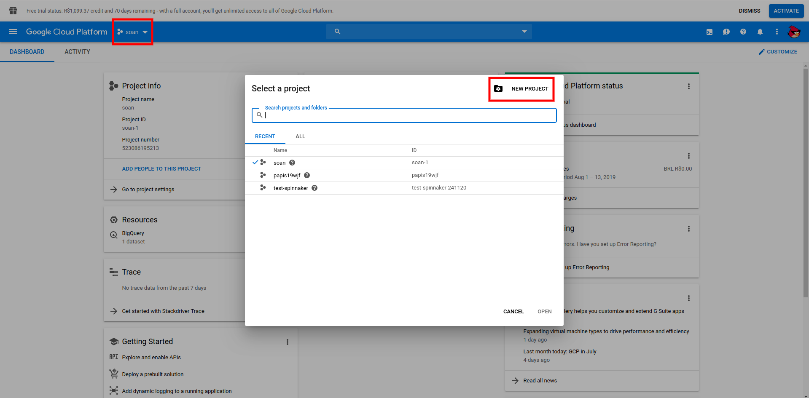
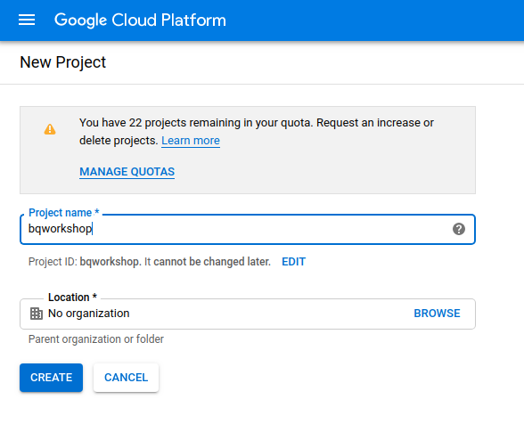

# Class 00: Setup

Before starting our Workshop, we have some setting up to do. To begin with, we need to prepare BigQuery for running our queries.

There are two options here: for those who don't want to use a credit card to setup an account, there's the option of using [BigQuery Sandbox](https://cloud.google.com/bigquery/docs/sandbox) which will allow us to run queries in the Web UI for free (given [quotas](https://cloud.google.com/bigquery/docs/sandbox#limits)). Keep in mind though that in this options some exercises and functionalities we make use of here won't work. For the most part though it should just be fine.

In order to fully make use of exercises and functionalities here presented, the second option would be to create an account in Google Cloud Platform (which requires the usage of a credit card). For newcomers, Google offers a $300 Credit [Free-Tier](https://cloud.google.com/free/) which is more than enough to cover all exercises suggested in this workshop.

Still, if you by any chance already used all those credits, as Google offers free usage quotas every month, it's possible to finish this workshop and not pay anything.

Those probably are the good news ;).

## GCP Projects

If you created an account in GCP, it's recommended to create a new project in your account to work with BigQuery and set up IAM requirements.

In your [GCP Console](https://console.cloud.google.com), click on "Select Project" on the left-upper coner and then chose "Create New Project" as shown in the image below:

Give your project an easy and well enough descriptive name for its main purpose (the ID has to be globally unique). For our workshop, calling it something like "bqworkshop" should already be good enough (remember to choose an appropriate organization if the option applies to you):

These steps being complete, it's time to start class 01 :).
