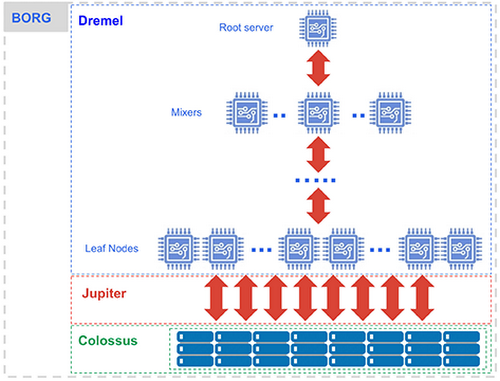
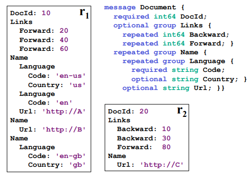
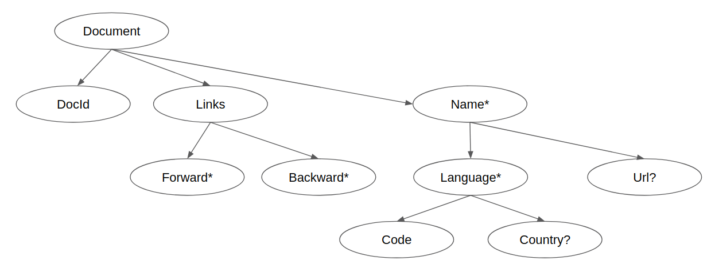
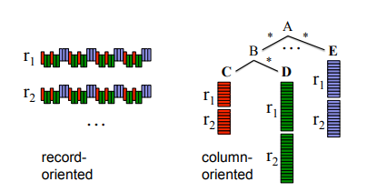
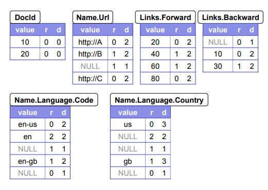

# Class 01: Arrays and Structs

## Introduction

BigQuery is a powerful serverless database service fully hosted by Google capable of processing terabytes of data in a few seconds.

Special emphasis for the *serverless* description: this means that we actually don't have to take any responsability with infrastructure or architectural designs in order to keep the tool up and running. In practice, using it is so simple that anyone can create an account, login for its sandbox environment and start using it right away.

In fact, it's due this simplicity that we started using it as our main database tool and now came up with this quick and dirty tutorial to teach a bit about what we've learned, some cool techniques and share some ideas for you to use in your projects as well.

As it keeps growing in popularity ([Kaggle](https://www.kaggle.com/dansbecker/getting-started-with-sql-and-bigquery) has already integrated its challenges datasets with BigQuery), knowing how to make good use of the tool can turn out to be a strong competitive advantage for undertaking new ideas and projects.

For what it follows, we'll give a brief overview of its architecture; this is not mandatory in order to understand BigQuery and we wrote it more for those who are curious. If you want to skip straight to action, please refer to section [x.x](#architecture).

## Architecture

Here, we'll briefly discuss on what is happening behind the scenes for BigQuery and its internal architecture; knowing it will help you to understand more about its philosophy on processing data (which basically comes from the Dremel architecture) and will allow you to further optimize big data processing.

To begin with, BigQuery is the integration of the following tools working together: [Colossus](https://cloud.google.com/files/storage_architecture_and_challenges.pdf), [Capacitor](https://cloud.google.com/blog/products/gcp/inside-capacitor-bigquerys-next-generation-columnar-storage-format), [Jupiter](https://cloudplatform.googleblog.com/2015/06/A-Look-Inside-Googles-Data-Center-Networks.html), [Dremel](https://storage.googleapis.com/pub-tools-public-publication-data/pdf/36632.pdf) and [Borg](https://ai.google/research/pubs/pub43438) as show below:

<p align="center">
  
</p>

Ok, that's lots of tools and each carries a whole universe of knowledge and concepts within themselves; while we won't cover the details, let's see briefly their purpose.

### Colossus

This is the fault-tolerant world-wide distributed storage system where our data is stored. If you look closely, you'll notice that it is separated from other componentes through the *Jupiter* network.

Yeap, that's right. At first this seems crazy, then you realize it's actually brilliant. When we send our data to BigQuery, the information is sent to Colossus which first applies different transformations on it (encoding and compressing to Capacitor format files) then finally replicates the data through different datacenters to ensure fault-tolerance.

Well, so you are probably asking yourself: "Ok but what if we query dozens of terabytes of data?! It'd be necessary to transfer teras through the network!!!".

Yeap again, that's right. But as it turns out, Jupiter is capable of processing up to *Petabytes* of data per second. You read that right, it's petabytes per second.

This is a very cool thing about the design worth keeping note of: *storage and processing are separate*. As Jupiter is insanely powerful, this enables the system to operate at much cheaper rates by using a multi-tenant architecture where you only pay for what you use. When we run queries, data is transferred to the computing servers, processed and results are returned which turns off computing costs. Effectively, you only pay for the amount of data queried over and its storage, nothing else. On top of that, the architecture ends up being quite flexible: changes made to the storage system doesn't affect processing servers or the other way around.

Now, as just mentioned, Colossus saves data in Capacitor format which is used by Dremel; lots of strategies and concepts happens here so let's dig a bit further into these tools.

### Capacitor

Here is one of the main points that makes BigQuery as powerful as it is: Dremel is fully designed to work with *nested data*.

Now, we should say, it gets practice to feel comfortable working with this type of data but once you master it, there's virtually no demand that comes into your way where you won't be able to effectively extract insights and answers to your demands.

You can think of nested data as a tree like structure that describes values and their relations between nodes; it can be thought as of a json-like format and, in fact, if you think about jsons when using BigQuery this can already be quite helpful when building queries.

To visualize it, let's see an example extracted from the Dremel paper as presented by Google:

<p align="center">
  
</p>

This follows a tree like structure that is represented (using the jargon as presented in Dremel's paper) as:

<p align="center">
  
</p>

The symbol *?* means the field is optional; + means it's repeated and required; \* means optional repeated.

It could also be represented by something that resembles a json-like format (this might help some to better visualize the data):

```
[
    {
        "DocId": 10,
        "Links": [{"Forward": 20}, {"Forward": 40}, {"Forward": 60}],
        [
            {"Name": [{"Language": {"Code": "en-us", "Country": "us"}}, {"Language": {"Code": "en"}}], "Url": "http://A"},
            {"Name": [{"Url": "http://B"}]},
            {"Name": [{"Language": {"Code": "en-gb", "Country": "gb"}}]}
        ]
    },
    {
        "DocId": 20,
        "Links": [{"Backward": 10}, {"Backward": 30}, {"Forward": 80}],
        [
            {"Name": [{"Url": "http://C"}]}
        ]
    }
]
```

Not only does Dremel work with nested data but also it follows a colunar type of storage; this is expected, most databases working with massive amounts of data uses this approach due advantages such as better degrees of compression and faster processing times; each field we have in our database is saved as a capacitor file containing all data of each column independently.

But, this is not a very straightforward thing to do. Keep in mind that every single record we have in our database has to be divided in its tree like structure and saved in a colunar format; bellow we see a representation of that:

<p align="center">
  
</p>

If we just save all values of a given node in a colunar format file, it won't be possible anymore to know when a given record started and when it ended or what values belong to a repeated field or not.

For fixing this, Capacitor saves for each value in our tree data two additional columns: *repetition (r)* and *definition level (d)*.

The first is a number that represents at which field in the path a given value has repeated.

Doesn't sound simple but it actually is. Let's see an example with our previous data to understand it better. Here's a full table of what would be saved as Capacitor files in Colossus:

<p align="center">
  
</p>

Let's examn the field *Name.Language.Code*. We would save in our field file the values "en-us", "en" and "en-gb".

The field *Code* has up to 3 branches in the tree strucute: first we have Name, then Language and finally Code. As it's used 0 index values, Name is 0, Language is 1 and finally Code is 2.

As we follow through the tree, first value we observe is "en-us". At this point, the first field in *Code* path that repeated is the field *Name* so we save it as a 0 which means "beginning of the record":


